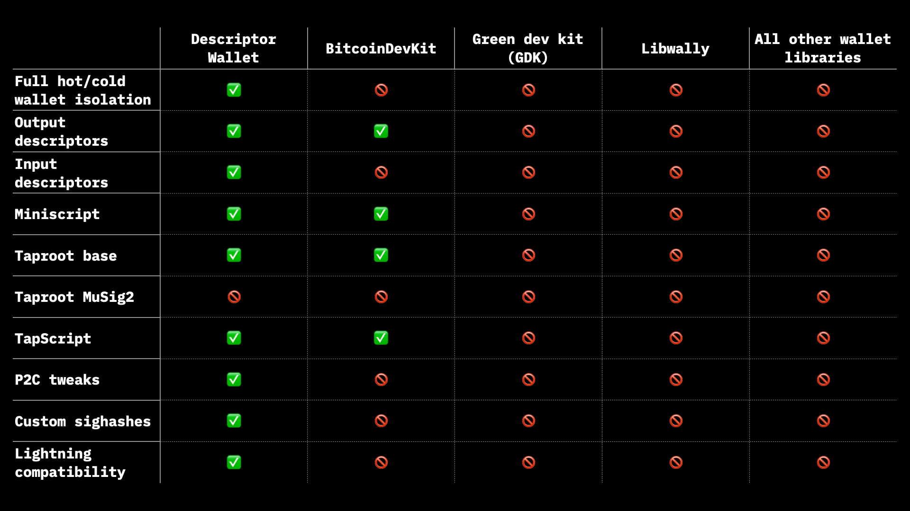

# Descriptor wallet library


[](https://codecov.io/gh/LNP-BP/descriptor-wallet)

[](https://crates.io/crates/descriptor-wallet)
[](https://docs.rs/descriptor-wallet)
[](https://github.com/rust-secure-code/safety-dance/)
[](./LICENSE)

Library for building descriptor-based bitcoin wallets. Everything a modern
cold and hot bitcoin wallet needs, but which is not (yet) a part of 
[rust-bitcoin](https://crates.io/bitcoin) library.

The library clearly separates parts requiring access to private keys from
those which should operate never touching them. It is advised that wallets
should be designed in a way assuming zero private key access for all of their
operations aside from transaction signing; this part must be separated into
other repository/library and be strictly controlled. One may look after
command-line `btc-hot` and `btc-cold` wallets in [`bin`](bin) directory for an
example of how this can be done.

Library provides
- efficient manipulations with BIP-32 derivation paths, separating derivations
  requiring private key access from those, which will always operate without;
- miniscript & classical bitcoin descriptors;
- PSBT constructor using input descriptors, which allow to specify custom 
  information about RBFs, previous public key P2C tweaks and custom hash types
  on a per-input basis;
- PSBT signer, supporting RBFs, relative and absolute timelocks, all sighash
  types, complex scripts, including witness- and taproot-based;
- script templates allowing embedding extended pubkeys into bitcoin script 
  assembly;
- lexicographic ordering of transaction & PSBT inputs & oututs;
- script type system;
- helper types for working with hash-lock contracts;
- PSBT utility functions (retrieving previous output, computing fee);
- transaction resolver API on top of Electrum Server API for convenience
  computation of already-mined transaction fees etc;
- support for SLIP-32/132 extended pubkey types (`ypub`, `zprv` etc).



## Command-line wallets

One may install command-line wallets with the following command (requires
rust compiler and `rustup` tools to be already installed on a system):
```console
$ rustup default stable
$ rustup update
$ git clone https://github.com/LNP-BP/descriptor-wallet
$ cd descriptor-wallet
$ cargo install --path . --locked --all-features
```

This will add `btc-hot` and `btc-cold` commands to the system.

[bin]: https://github.com/LNP-BP/descriptor-wallet/tree/master/src/bin
